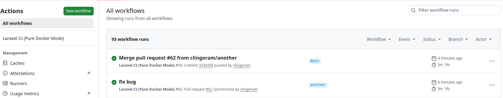

## Laravel ToDo-list

- Laravel ToDo List是使用Laradock 建置Laravel 8、資料庫:MySQL
- 在Full calendar上讀取該月份資料
- 使用者可點選日期並新增、更新、刪除、查看資料

## 2021年更新:

- UI改變，使用Full calendar
- 使用者可新增與刪除待辦事項分類，並自由歸類待辦事項分類
- PHPUnit Test
- API文件

## 2026年更新：

- 將Laravel Sail轉成Docker，使用Laravel 10(由於許多套件是舊版或不再維護，因此新增或移除部份套件)
- 為此新增：Dockerfile、docker-compose.yml以及laravel.yml(for CI)

### 🧪 自動化測試與持續整合 (CI/CD) with GitHub Actions

本專案導入了完整的 **DevOps 自動化工作流**。每次程式碼Push或Pull Request至`main`分支時，皆會觸發GitHub Actions進行自動化建置與測試。

- **環境隔離**：測試流程完全運行於純Docker容器環境中，確保測試環境與生產環境高度一致。
- **測試涵蓋**：包含Feature Tests與Unit Tests，確保API邏輯與資料庫關聯正確性。

#### 📊 CI 執行狀態 ✅

